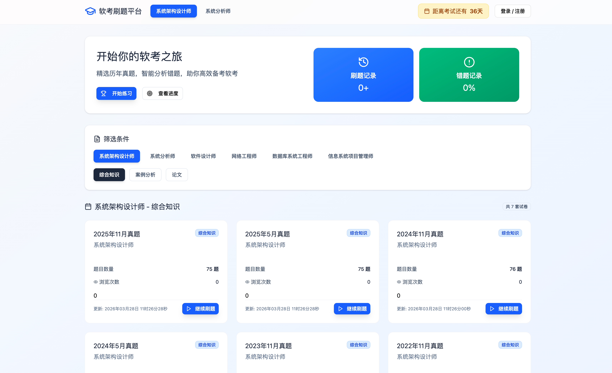
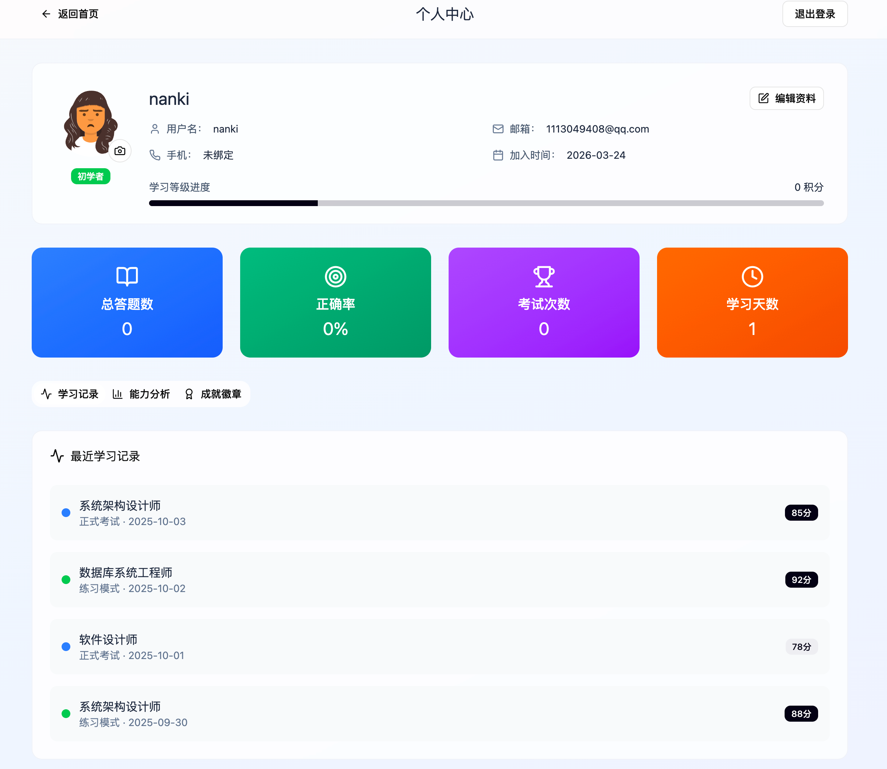
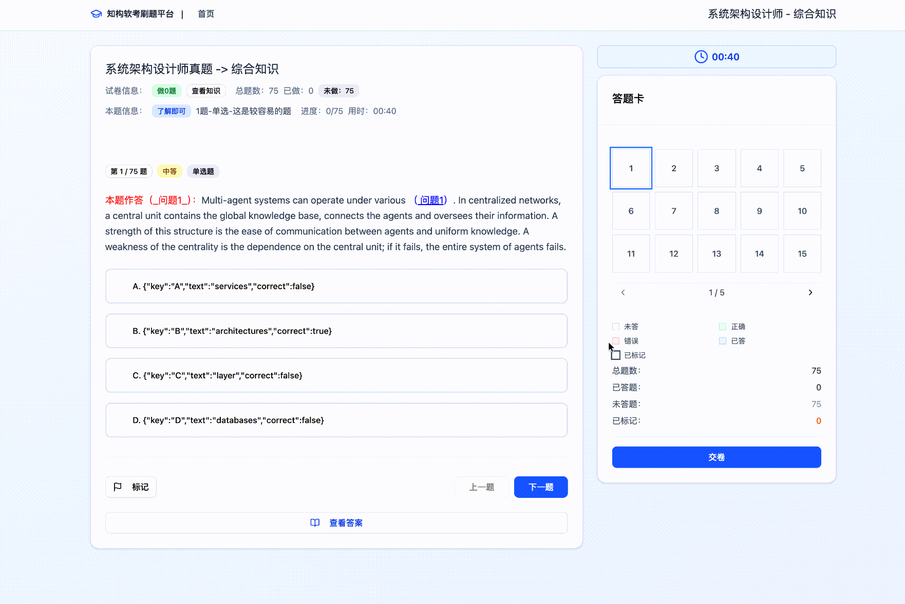

# 知构软考刷题平台

> 把题库、知识点和 AI 分析连成一张备考地图。

<div align="center">


**🚧 项目正在积极开发中，欢迎 Star、提 Issue 和 PR 参与共建！**

[在线演示](#-在线体验) | [快速开始](#-快速开始) | [贡献指南](#-参与贡献)

</div>

---

**知构（Zhigou Prep）** 是一个面向软考备考场景的智能刷题与学习平台（历年真题 + 错题沉淀 + AI 分析），基于 Spring Boot + React 全栈开发，通过结构化的知识体系和智能化的练习系统，帮助考生高效备考。

<div align="center">
  
  
  
</div>

## 📦 项目简介

本项目采用前后端分离架构，包含：

- **后端服务** (`aisoftoj-backend`)：基于 Spring Boot + MyBatis-Plus 构建，提供 RESTful API
- **前端应用** (`aisoftoj-front`)：基于 React 18 + Vite + TypeScript 构建，提供现代化用户界面
- **数据库设计** (`db_schema.sql`)：完整的 MySQL 数据库建表脚本

### ✨ 核心特性

- 📚 **丰富的题库资源**：覆盖系统分析师、系统架构设计师等热门考试科目
- 🎯 **智能练习模式**：支持练题模式和考试模式，满足不同学习阶段需求
- 📊 **实时反馈机制**：答题后立即显示解析，帮助理解知识点
- 📈 **学习进度追踪**：记录刷题历史和错题本，精准定位薄弱环节
- 🔐 **完善的用户体系**：邮箱登录注册，全局认证管理

### 🎯 覆盖科目

#### 已上线科目

| 科目名称 | 科目代码 | 试卷类型 | 题目数量 |
|---------|---------|---------|---------|
| 系统分析师 | 000331 | 案例分析、综合知识、论文 | 持续更新中 |
| 系统架构设计师 | 000401 | 案例分析、综合知识、论文 | 持续更新中 |

#### 即将上线

- 网络工程师
- 软件设计师
- 数据库系统工程师
- 信息系统项目管理师

> 💡 注：科目代码遵循国家软考中心官方编码规则

## 🎨 功能展示

### 前端已实现功能

- ✅ 首页试卷列表与筛选
- ✅ 历年真题专项练习
- ✅ 自定义刷题配置（科目/分类/难度/题量）
- ✅ 完整答题会话流程（倒计时/标记/答题卡）
- ✅ 交卷后智能评分与解析
- ✅ 个人中心与学习档案管理
- ✅ 刷题记录回顾与复盘
- ✅ 错题本自动整理

### ⚙️ 后端接口能力

- ✅ 试卷列表查询与筛选
- ✅ 试卷详情及题目获取
- ✅ 单题详情查询（含答案控制）
- ✅ 刷题会话创建与管理
- ✅ 答题记录实时更新
- ✅ 试卷提交与智能阅卷
- ✅ 用户认证与授权

## 🛠️ 技术架构

### 后端技术栈

- **核心框架**：Spring Boot 2.7.18
- **ORM 框架**：MyBatis-Plus 3.5.5
- **数据库**：MySQL 5.7+ / 8.x
- **工具库**：Lombok、Hutool
- **构建工具**：Maven 3.6+
- **JDK 版本**：Java 8

### 前端技术栈

- **UI 框架**：React 18
- **构建工具**：Vite 6
- **开发语言**：TypeScript
- **路由管理**：React Router v7
- **UI 组件库**：Shadcn UI (Radix UI)
- **图表库**：Recharts
- **图标库**：Lucide React
- **表单处理**：React Hook Form
- **Markdown 渲染**：React Markdown
- **CSS 框架**：Tailwind CSS

### 数据存储策略

- **生产环境**：后端使用 MySQL 持久化存储（7 张核心表）
- **开发环境**：前端原型阶段使用本地静态数据和 localStorage

## 📁 项目结构

```text
.
├── aisoftoj-backend/                 # Spring Boot 后端
│   └── src/main/java/com/nan/aisoftoj/
│       ├── controller/               # 6 个 REST 控制器
│       ├── service/impl/             # 业务逻辑实现
│       ├── mapper/                   # MyBatis-Plus Mapper
│       ├── entity/                   # 6 个实体类
│       ├── dto/                      # 18 个 DTO
│       └── common/                   # 全局异常处理、统一响应
├── aisoftoj-front/                   # React 前端原型
│   └── src/
│       ├── components/               # 页面组件 + ui/ (Shadcn)
│       ├── data/                     # mock 静态数据
│       ├── hooks/                    # useAuth.tsx, useExamSession.ts
│       ├── lib/api.ts                # API 请求封装
│       └── types/                    # 类型定义
├── db_schema.sql                     # 建表 + 初始数据脚本
├── pom.xml                           # Maven 聚合工程
└── README.md
```

## 🚀 快速开始

### 环境要求

在开始之前，请确保你的开发环境满足以下要求：

- **JDK**：8 或以上版本
- **Maven**：3.6 或以上版本
- **MySQL**：5.7 或 8.x 版本
- **Node.js**：18 或以上版本
- **npm**：随 Node.js 一起安装

### 1️⃣ 初始化数据库

创建数据库：

```sql
CREATE DATABASE aisoftoj DEFAULT CHARACTER SET utf8mb4 COLLATE utf8mb4_general_ci;
```

执行建表脚本：

```bash
mysql -uroot -p aisoftoj < db_schema.sql
```

导入初始数据（可选）：

```bash
mysql -uroot -p aisoftoj < db_init_data.sql
```

### 2️⃣ 启动后端服务

#### 配置数据库连接

修改 [`application.yml`](aisoftoj-backend/src/main/resources/application.yml) 中的数据库配置：

```yaml
server:
  port: 8080
spring:
  datasource:
    url: jdbc:mysql://localhost:3306/aisoftoj?useUnicode=true&characterEncoding=utf8&serverTimezone=Asia/Shanghai
    username: root
    password: abc123456
```

#### 启动方式

**方式一：使用 Maven 命令（推荐）**

```bash
mvn -pl aisoftoj-backend spring-boot:run
```

**方式二：使用 IDE 运行**

1. 用 IDEA 或其他 Java IDE 打开项目
2. 找到启动类 [`AisoftojApplication.java`](aisoftoj-backend/src/main/java/com/nan/aisoftoj/AisoftojApplication.java)
3. 直接运行 main 方法

启动成功后，后端服务访问地址：**http://localhost:8080**

### 3️⃣ 启动前端应用

```bash
cd aisoftoj-front
npm install
npm run dev
```

启动成功后，前端访问地址：**http://localhost:5173**

### 🌐 在线体验

> 💡 公共演示环境部署中，敬请期待！
>
> GitHub 仓库：https://github.com/Nanki-nn/aisoftoj

## 🤝 参与贡献

项目仍在持续开发中，非常欢迎各种形式的贡献！

### 贡献方式

- 🐛 **报告 Bug**：遇到问题请 [提 Issue](../../issues)，附上复现步骤和截图
- 💡 **提出需求**：有好的功能想法欢迎开 Issue 讨论
- 🔧 **提交代码**：Fork 仓库后开发新功能或修复 Bug，完成后发 Pull Request
- 📖 **完善文档**：改进 README、补充注释、优化接口说明等

### 开发规范

- 代码风格尽量与现有代码保持一致
- 提交前确保本地测试通过
- Commit message 清晰描述改动内容

如果这个项目对你有帮助，欢迎点个 ⭐ **Star** 支持一下！

**GitHub**：https://github.com/Nanki-nn/aisoftoj

<div align="center">


</div>

## 📱 交流群

> 扫描下方二维码加入微信交流群，一起备考、交流开发进度。
>
> 也可以直接加微信 `你的微信号` 备注「知构」，我拉你进群。

<div align="center">
  
</div>

---

## 📄 License

本项目采用 MIT 协议开源，详见 LICENSE 文件。

---

<div align="center">

Made with ❤️ by 知构团队 | [Nanki-nn/aisoftoj](https://github.com/Nanki-nn/aisoftoj)

</div>
