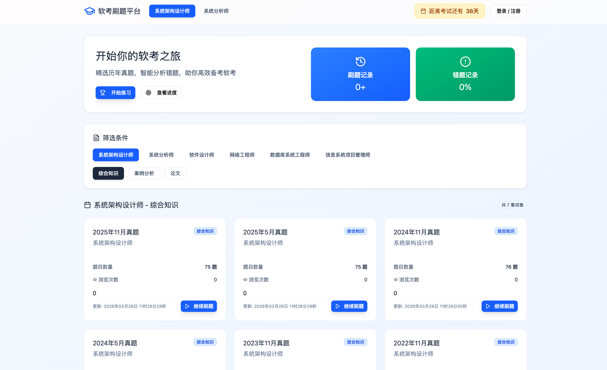
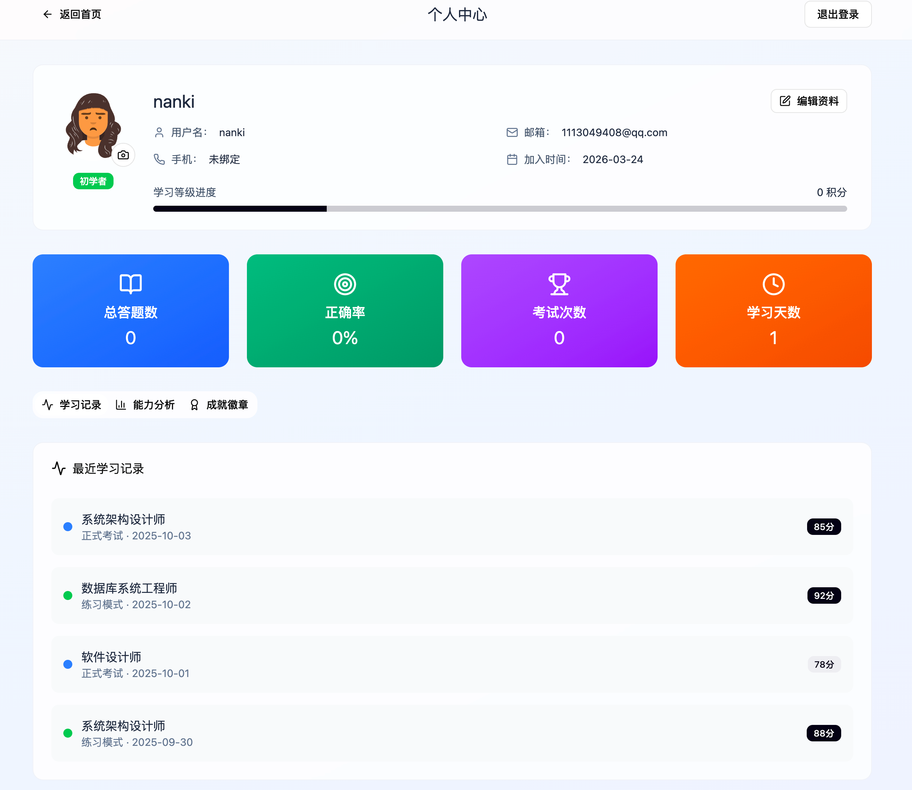
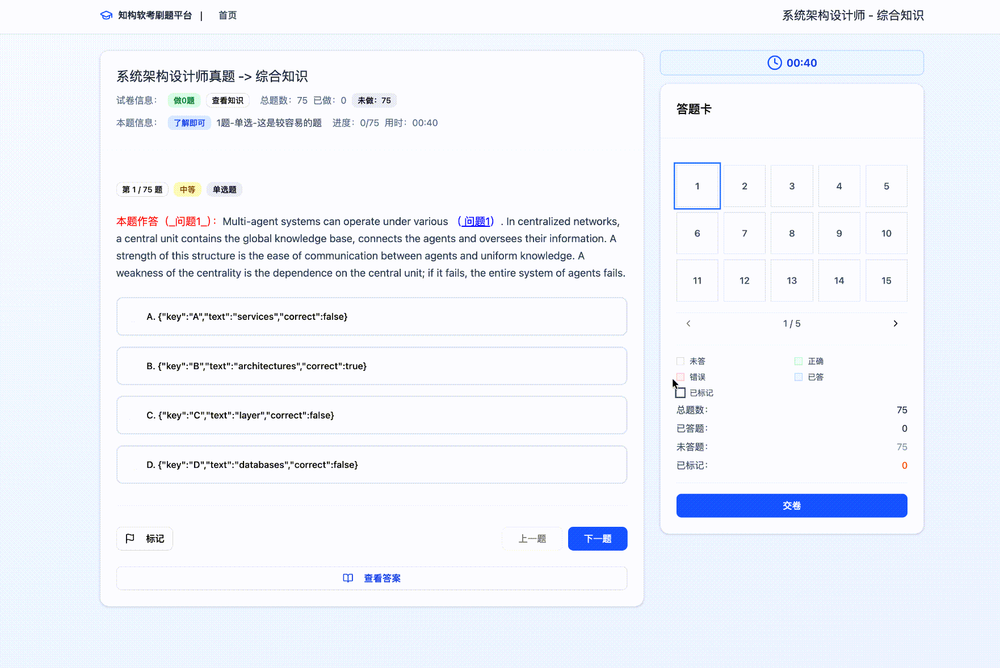

# 知构软考平台

> 把题库、知识点和 AI 分析连成一张备考地图。

**🚧 项目正在积极开发中，欢迎 Star、提 Issue 和 PR 参与共建！**

[在线演示](#-在线体验) | [备考经验](guides/系统架构师备考经验.md) | [贡献指南](#-参与贡献)

---

**知构（Zhigou Prep）** 是一个面向软考备考场景的智能刷题与学习平台（历年真题 + 错题沉淀 + AI 分析），基于 Spring Boot + React 全栈开发，通过结构化的知识体系和智能化的练习系统，帮助考生高效备考。

> 📘 如果你也在准备软考，欢迎先看这篇经验分享：[我的软考高级备考经验](guides/系统架构师备考经验.md)
>
> 📚 配套资料笔记：[《系统架构师》语雀笔记](https://www.yuque.com/jiangnan-3o7ge/psketn)

  
  
  

## 📦 项目简介

本项目采用前后端分离架构，包含：

- **后端服务** (`aisoftoj-backend`)：基于 Spring Boot + MyBatis-Plus 构建，提供 RESTful API
- **前端应用** (`aisoftoj-front`)：基于 React 18 + Vite + TypeScript 构建，提供现代化用户界面
- **数据库设计** (`db_schema.sql`)：完整的 MySQL 数据库建表脚本

### ✨ 核心特性

- 📚 **丰富的题库资源**：覆盖系统分析师、系统架构设计师等热门考试科目
- 🎯 **智能练习模式**：支持练题模式和考试模式，满足不同学习阶段需求
- 📊 **实时反馈机制**：答题后立即显示解析，帮助理解知识点
- 📈 **学习进度追踪**：记录刷题历史和错题本，精准定位薄弱环节
- 🔐 **完善的用户体系**：注册邮箱验证、密码登录、邮箱验证码免密登录、找回密码与全局认证管理

### 🎯 覆盖科目

#### 已上线科目

| 科目名称 | 科目代码 | 试卷类型 | 题目数量 |
|---------|---------|---------|---------|
| 系统分析师 | 000331 | 案例分析、综合知识、论文 | 持续更新中 |
| 系统架构设计师 | 000401 | 案例分析、综合知识、论文 | 持续更新中 |

#### 即将上线

- 网络工程师
- 软件设计师
- 数据库系统工程师
- 信息系统项目管理师

> 💡 注：科目代码遵循国家软考中心官方编码规则

## 🌐 在线体验

> 🚀 正式站点：[https://aisoftoj.cn/](https://aisoftoj.cn/)
>
> GitHub 仓库：https://github.com/Nanki-nn/aisoftoj

## 🤝 参与贡献

项目仍在持续开发中，非常欢迎各种形式的贡献！

### 贡献方式

- 🐛 **报告 Bug**：遇到问题请 [提 Issue](../../issues)，附上复现步骤和截图
- 💡 **提出需求**：有好的功能想法欢迎开 Issue 讨论
- 🔧 **提交代码**：Fork 仓库后开发新功能或修复 Bug，完成后发 Pull Request
- 📖 **完善文档**：改进 README、补充注释、优化接口说明等

### 开发规范

- 代码风格尽量与现有代码保持一致
- 提交前确保本地测试通过
- Commit message 清晰描述改动内容

如果这个项目对你有帮助，欢迎点个 ⭐ **Star** 支持一下！

**GitHub**：https://github.com/Nanki-nn/aisoftoj

## 📱 交流群

### 微信交流群

> 扫描下方二维码加入微信交流群，一起备考、交流开发进度。
>
> 也可以直接加微信 `你的微信号` 备注「知构」，我拉你进群。

  

### QQ 交流群

> 扫描下方二维码加入 QQ 交流群，一起交流软考备考经验。

  

---

## 📄 License

本项目采用 MIT 协议开源，详见 LICENSE 文件。

---

Made with ❤️ by 知构团队 | [Nanki-nn/aisoftoj](https://github.com/Nanki-nn/aisoftoj)

