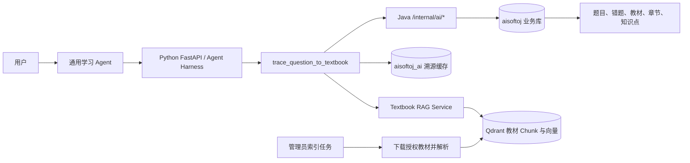

# 教材溯源 RAG Agent Tool 设计

## 背景

本设计服务于 Issue [#12](https://github.com/Nanki-nn/aisoftoj/issues/12)，并参考已关闭且未合并的 PR [#11](https://github.com/Nanki-nn/aisoftoj/pull/11) 中“教材解析、向量检索、知识点与错题对齐”的思路。

首版只支持一本《系统架构设计师教程》。平台不向用户托管或分发教材文件，只保存官方或已授权的外部地址。后台可以在授权范围内临时下载教材用于建立索引，索引完成后删除临时原文件。

功能不是独立的错题详情按钮，而是通用学习 Agent 的一个只读工具。用户在对话中询问“这道题出自教材哪里”“应该复习哪一章”等问题时，Agent 调用教材溯源工具，实时组织回答并给出可验证的章节、页码和短证据片段。

## 目标

- 将教材正文构建成保留章节和真实页码的版本化 RAG 索引。
- 为通用学习 Agent 增加 `trace_question_to_textbook` 只读工具。
- 首次查询实时执行检索和重排，后续复用版本化结构化缓存。
- Agent 每次结合当前对话实时生成回答，不缓存最终自然语言回答。
- 章节、页码和引用必须来自实际命中的教材 Chunk，不允许模型编造。
- 继续遵守现有架构：Java 拥有业务事实，Python 只通过 Java 内部接口读取平台数据；Python 只写独立的 `aisoftoj_ai` 数据库和 Qdrant。
- 为后续相似题推荐、教材问答和错题复习规划提供可复用的教材检索能力。

## 非目标

- 不提供用户上传教材。
- 不托管教材下载文件，也不绕过官方或授权来源的访问控制。
- 不支持多教材选择或多版本同时面向用户展示。
- 不引入 Neo4j 或用户知识图谱。
- 不做全题库离线预计算。
- 不实现 Issue #13 相似题推荐。
- 不实现完整教材管理后台；首版使用初始化数据、管理员 API 或管理命令维护教材并触发索引。
- 不把教材索引、删除索引等写操作暴露为 Agent Tool。

## 已确认决策

- 教材由平台统一指定，普通用户只能查看溯源结果。
- 首版教材固定为一本《系统架构设计师教程》，但名称、版次、ISBN 和地址仍存数据库，不写死在代码中。
- 用户看到的是官方或授权外部链接，平台不保存可供用户下载的教材原文件。
- 题目与教材的逻辑关系为 `题目 -> 知识点 -> 教材章节/页码`。
- 一道题允许一个主要知识点和多个次要知识点。
- 教材溯源封装成通用学习 Agent 的工具，不建立独立用户流程。
- 采用混合策略：首次实时 RAG，MySQL 缓存结构化溯源事实，Agent 每次实时生成回答。
- 首版不做完整管理界面，优先完成 RAG 与 Agent Tool 闭环。

## 与现有系统的关系

本设计扩展现有 [AI Agent 运行时设计](./2026-08-17-ai-agent-runtime-design.md)：

- 浏览器继续直接访问 Python FastAPI AI 服务。
- Thread、Run、Message、Event 和 Agent 自有数据继续写入独立 `aisoftoj_ai` 数据库。
- Agent 使用当前 Run 中未持久化的用户 JWT 和服务密钥调用 Java `/internal/ai/*`。
- Java 继续拥有题目、错题、教材目录和知识点等平台业务数据。
- 新工具继续只读，不创建会话、不修改答案、不交卷，也不修改教材业务数据。
- 教材索引任务是独立管理员能力，不属于 Agent 工具权限。

现有 `GET /internal/ai/questions/{questionId}` 可以提供题目基础数据。若调用来自错题语境，可继续通过现有错题复盘接口取得当前用户的错误次数、最近错误时间和答案等用户上下文。所有读取均先由 Java 验证 JWT；Python 不信任模型提供的用户 ID。

## 总体架构



### 数据归属

| 数据 | 所有者 | 存储 |
|---|---|---|
| 教材名称、版次、ISBN、官方地址 | Java 平台 | `aisoftoj` MySQL |
| 章节树、印刷页码、PDF 页序号 | Java 平台 | `aisoftoj` MySQL |
| 稳定知识点和教材位置映射 | Java 平台 | `aisoftoj` MySQL |
| 教材正文切块、Embedding、索引元数据 | Python AI 服务 | Qdrant |
| 索引任务、索引版本、溯源缓存 | Python AI 服务 | `aisoftoj_ai` MySQL |
| 用户对话、Run、工具事件 | Python AI 服务 | `aisoftoj_ai` MySQL |

Python 写入 Agent 自有缓存不改变 Java 业务事实，因此不违反“Agent 对平台业务只读”的现有边界。

## Java 业务数据模型

### `textbook`

- `id`: BIGINT 主键。
- `subject_name`: 首版为系统架构设计师。
- `name`: 教材名称。
- `edition`: 版次。
- `isbn`: 可空 ISBN。
- `official_url`: 官方或授权外部地址。
- `viewer_page_template`: 可空；支持页跳转时包含 `{pdfPage}` 占位符，否则只使用 `official_url`。
- `status`: `DRAFT`、`ACTIVE`、`DISABLED`。
- `create_time`、`update_time`、`is_deleted`。

首版只允许一本 `ACTIVE` 教材，但数据结构不依赖固定主键。

### `textbook_section`

- `id`: BIGINT 主键。
- `textbook_id`: 所属教材。
- `parent_id`: 父章节，可空。
- `level`: 章节层级。
- `section_code`: 如 `3.2`。
- `title`: 章节标题。
- `printed_page_start`、`printed_page_end`: 书本印刷页码。
- `pdf_page_start`、`pdf_page_end`: PDF 阅读器实际页序号。
- `sort_order`、`create_time`、`update_time`、`is_deleted`。

必须同时保存印刷页码和 PDF 页序号。封面、目录、前言等页面会造成两者不一致，用户展示使用印刷页码，外部阅读器跳转使用 PDF 页序号。

### `knowledge_point`

- `id`: BIGINT 主键，作为所有 AI 结果中的稳定知识点 ID。
- `subject_name`: 所属科目。
- `parent_id`: 支持一级/二级知识点。
- `level`: 首版只允许 1 或 2。
- `code`: 稳定唯一编码。
- `name`: 知识点名称。
- `description`: 简短定义，供检索和消歧使用。
- `status`、`create_time`、`update_time`、`is_deleted`。

### `knowledge_point_source`

- `id`: BIGINT 主键。
- `knowledge_point_id`: 稳定知识点 ID。
- `textbook_section_id`: 教材章节 ID。
- `printed_page_start`、`printed_page_end`。
- `pdf_page_start`、`pdf_page_end`。
- `is_primary`: 是否为该知识点主要出处。
- `create_time`、`update_time`、`is_deleted`。

首版通过迁移脚本或初始化数据维护上述记录，不要求完整管理 UI。

## AI 数据模型

### `ai_textbook_indexes`

- `id`: UUID 主键。
- `textbook_id`: Java 教材 ID，无跨库外键。
- `index_version`: 唯一版本标识。
- `source_hash`: 下载文件 SHA-256。
- `parser_name`、`parser_version`。
- `embedding_model`、`reranker_model`。
- `collection_name`: Qdrant Collection。
- `chunk_count`。
- `status`: `BUILDING`、`ACTIVE`、`FAILED`、`RETIRED`。
- `error_code`: 可空稳定错误码，不保存原始异常。
- `created_at`、`activated_at`、`retired_at`。

同一本教材最多只有一个 `ACTIVE` 索引。新版本完整写入 Qdrant 并通过检查后，在 AI 数据库事务内退役旧版本并激活新版本；构建失败时旧版本继续服务。

### `ai_question_trace_cache`

- `id`: UUID 主键。
- `question_id`: Java 题目 ID。
- `question_content_hash`: 规范化题干、选项、解析和分类的 SHA-256。
- `textbook_id`。
- `index_version`。
- `retrieval_profile_version`: 检索、切块、阈值和重排策略版本。
- `status`: `FOUND` 或 `INSUFFICIENT_EVIDENCE`。
- `primary_knowledge_point_id`: 可空 Java 知识点 ID。
- `secondary_knowledge_point_ids_json`。
- `source_chunk_ids_json`。
- `confidence`: 0 到 1。
- `result_json`: 结构化教材事实和短证据，不含用户答案、个人信息或外部链接。
- `created_at`、`expires_at`。

唯一键为：

```text
question_id
+ question_content_hash
+ textbook_id
+ index_version
+ retrieval_profile_version
```

缓存是跨用户共享的教材事实。工具必须先通过 Java 完成题目访问校验，之后才能读取共享缓存，避免缓存成为题目存在性探测接口。

`official_url` 和 `viewer_page_template` 不进入缓存。每次返回 Tool 结果时都从 Java 当前 `textbook` 记录读取并构造链接，避免管理员更换授权地址后缓存继续暴露旧地址。

## Qdrant 数据模型

首版使用一个教材 Chunk Collection，并通过 `textbook_id + index_version` 过滤。每个 Point 至少包含：

```json
{
  "textbookId": 1,
  "indexVersion": "v20260826-01",
  "sectionId": 32,
  "chapterPath": ["第3章 软件架构", "3.2 架构风格"],
  "pdfPageStart": 92,
  "pdfPageEnd": 95,
  "printedPageStart": 86,
  "printedPageEnd": 89,
  "chunkHash": "sha256:...",
  "text": "教材正文"
}
```

`chapterPath`、两套页码和 `sectionId` 均由索引任务写入。Tool 和 Agent 不允许重写这些字段。

## 教材索引流程

教材索引是管理员触发的独立任务，不在 Agent 对话中执行。

1. 管理员在 Java 业务库登记教材、官方地址、章节树和页码。
2. 管理员通过 Python 管理 API 或 CLI 触发索引，参数只有 `textbook_id`。
3. Python 使用当前管理员 JWT 调用 Java `/internal/ai/me` 验证 `ADMIN` 角色，并读取教材索引源数据。
4. 下载器只允许 HTTPS 和配置的授权域名，拒绝内网地址、DNS 重绑定、重定向到内网、超限响应和错误文件类型。
5. 下载到临时目录后计算 SHA-256。相同教材和摘要已有成功索引时返回幂等结果。
6. `TextbookExtractor` 逐页输出文字块和 PDF 页序号。
7. 首版实现优先使用 PyMuPDF；解析器作为接口隔离。如果教材为扫描版或复杂布局导致质量不达标，可增加 MinerU 实现而不改变后续索引与 Tool 契约。
8. 根据管理员维护的 `textbook_section` 页码范围，把每个正文块绑定到稳定 `sectionId`。
9. 按章节边界和段落切块；禁止跨越无关章节拼接。切块大小和重叠量属于 `retrieval_profile_version` 配置。
10. 生成 Dense Embedding；若启用稀疏检索，同时生成中文关键词或 Sparse Vector。
11. 批量写入新 `index_version` 的 Qdrant Points。
12. 校验 Chunk 数量、页码覆盖、章节覆盖、空文本比例和随机抽样可读取性。
13. 校验通过后激活新版本；失败则标记 `FAILED`，旧版本继续服务。
14. 删除临时教材文件。失败清理写安全化告警，但不得把本地路径暴露给前端。

索引 API 不属于 Agent Tool，也不出现在模型工具列表中。

## Agent Tool 契约

### 工具定义

```json
{
  "name": "trace_question_to_textbook",
  "description": "查找一道软考题在指定教材中的知识点、章节、页码和教材证据",
  "parameters": {
    "question_id": {
      "type": "integer",
      "description": "题库中的题目 ID"
    }
  },
  "required": ["question_id"]
}
```

模型只能提供 `question_id`。用户 ID、JWT、教材 ID、索引版本、缓存刷新和检索阈值由 Runtime 注入或服务端解析。

当 Agent Panel 已携带 `currentQuestionId` 时，Agent 可以在用户询问教材出处、复习章节或知识点来源时调用工具。用户没有提供或页面上下文没有题目 ID 时，Agent 应先要求用户明确题目，不能猜测 ID。

### 成功返回

```json
{
  "status": "found",
  "questionId": 123,
  "cacheStatus": "miss",
  "primaryKnowledgePoint": {
    "id": 128,
    "name": "管道—过滤器架构"
  },
  "secondaryKnowledgePoints": [],
  "sources": [
    {
      "chunkId": "chunk-386",
      "textbookId": 1,
      "textbookName": "系统架构设计师教程",
      "sectionId": 32,
      "chapterPath": ["第3章 软件架构", "3.2 架构风格"],
      "printedPageStart": 86,
      "printedPageEnd": 89,
      "pdfPageStart": 92,
      "pdfPageEnd": 95,
      "officialUrl": "https://authorized.example/book.pdf",
      "viewerUrl": "https://authorized.example/book.pdf#page=92",
      "evidence": "受长度限制的教材证据片段",
      "relevanceScore": 0.87
    }
  ],
  "indexVersion": "v20260826-01"
}
```

### 稳定状态

- `found`: 存在达到阈值且引用校验通过的来源。
- `insufficient_evidence`: 检索到相关内容，但无法可靠定位知识点或出处。
- `unavailable`: 当前没有可用索引或依赖暂时不可用。

Agent 必须忠实使用返回的章节、页码、链接和知识点。`insufficient_evidence` 时明确说明未找到可靠出处；`unavailable` 时说明功能暂时不可用。任何状态都不能根据模型常识补写教材页码。

## 在线检索与生成流程

```text
用户提问
  -> Agent 判断需要教材溯源
  -> trace_question_to_textbook(question_id)
  -> Java 权限校验并读取题目
  -> 查询当前索引版本和版本化缓存
  -> 缓存未命中时执行 Hybrid Retrieval
  -> Reranker 重排
  -> 按章节和知识点聚合
  -> 引用校验
  -> 写 AI 缓存
  -> Agent 基于结构化结果实时生成回答
```

### 查询构造

- 题干是主要语义。
- 选项中的专业概念作为补充。
- 现有解析和分类可以使用，但权重低于题干，避免旧解析完全支配检索。
- 当前自然语言追问只用于确定解释重点，不改变题目事实。

### 检索与重排

- Dense Vector 检索负责语义召回。
- 中文关键词或 Sparse Vector 检索负责术语、缩写和专有名词召回。
- 两路结果使用稳定融合策略合并。
- Reranker 将较宽候选集收敛为少量高质量证据。
- 全程强制过滤 `textbook_id + index_version`。

### 知识点计算

候选知识点来自命中章节关联的 `knowledge_point_source`，不能自由生成新知识点。Tool 按 Rerank 分数、多个 Chunk 的一致性和知识点主要出处进行聚合：

- 得分最高且达到阈值的知识点为主要知识点。
- 其他达到次要阈值的不同知识点作为次要知识点。
- 分数过低、前两名差距过小或证据跨多个不相干章节时返回 `insufficient_evidence`。

Tool 不再调用第二个生成模型。外层学习 Agent 本身承担 RAG 的 Generate 环节，避免“Agent -> Tool 内 LLM -> Agent”重复生成和双重 Token 成本。

### 引用校验

在 Tool 返回结果前执行确定性校验：

- 所有 `chunkId` 必须来自本次检索或当前版本缓存。
- `sectionId`、章节路径和页码必须与 Qdrant Chunk Payload 一致。
- `knowledgePointId` 必须存在于 Java 提供的稳定候选集合。
- `viewerUrl` 只能由可信 `viewer_page_template` 或 `official_url` 和 PDF 页序号构造。
- 短证据片段必须来自对应 Chunk，并受长度上限限制。

## 缓存策略

- `FOUND` 结果按题目内容、教材索引和检索策略版本复用，不设置短固定 TTL；任一版本变化自然失效。
- `INSUFFICIENT_EVIDENCE` 使用短期 TTL，避免连续追问反复检索，同时允许后续索引或策略升级重新判断。
- `UNAVAILABLE` 不作为长期业务结果缓存。
- 用户明确要求“重新查教材”时，Agent Runtime 可以在服务端绕过缓存；强制刷新不作为模型可自由填写的 Tool 参数。
- 缓存只保存跨用户共享的教材事实，不保存用户作答、错题原因或个性化建议。
- Agent 的最终自然语言回答不写入溯源缓存；它仍作为普通 Assistant Message 持久化。

首版缓存只覆盖用户实际查询过的题目。未来需要全库知识点统计时，可以复用相同 Retrieval Service 做离线缓存预热，不改变 Tool 契约。

## 错误处理与降级

| 场景 | 行为 |
|---|---|
| Java 认证失败 | 终止工具调用，不透露题目是否存在 |
| 用户无权访问当前错题上下文 | 返回现有稳定 `access_denied` 工具错误 |
| 当前没有 `ACTIVE` 教材或索引 | 返回 `unavailable/index_not_ready` |
| Qdrant 或 Reranker 超时 | 有当前版本缓存则返回缓存，否则返回 `unavailable` |
| 检索无可靠证据 | 返回 `insufficient_evidence`，Agent 不猜测 |
| 外部教材链接失效 | 仍可展示缓存章节和页码，并提示链接不可用 |
| Agent Run 取消 | 取消正在进行的检索和重排，不继续写缓存 |
| 缓存写入失败 | 返回本次已校验结果，记录安全化告警 |
| 新教材索引构建失败 | 保留旧 `ACTIVE` 索引，不影响现有查询 |

工具错误继续通过现有 Tool Error Middleware 转换为稳定错误；用户可见 Tool Event 只展示“正在查找教材出处”“已找到教材位置”或“未找到可靠出处”等安全摘要，不包含题干、正文、JWT、内部路径或原始异常。

## 安全与内容边界

- 每次工具调用先通过 Java 校验用户和题目访问权限，再查询共享缓存。
- Python 不接受模型传入的用户 ID、教材地址、索引版本或 Collection 名称。
- 索引下载器仅允许 HTTPS 和授权域名，解析每次重定向，并拒绝回环、链路本地、私网和保留地址。
- 限制响应头、文件大小、下载时间、重定向次数和实际 MIME；不以扩展名代替内容校验。
- 临时教材文件不得进入仓库、对象存储、日志、异常信息或用户下载接口。
- 教材证据只返回解释所需的短片段，不返回整页或整章。
- 日志不记录完整题干、教材正文、用户答案、JWT、服务密钥或模型原始上下文。
- Qdrant、AI 数据库和索引管理接口不得直接暴露到公网。
- 发布前必须确认教材来源允许平台按预期下载、处理和向用户展示短引用；本设计不构成版权授权。

## 可观测性

至少记录以下不含正文的指标：

- 索引任务耗时、文件摘要、Chunk 数量、章节覆盖率、页码覆盖率和失败错误码。
- Tool 调用次数、缓存命中率、`found/insufficient/unavailable` 比例。
- Java 读取、向量检索、Sparse 检索、Rerank、引用校验和缓存写入分段耗时。
- 候选数量、最终来源数量和置信度分布，不记录原始证据。
- 按 `index_version` 和 `retrieval_profile_version` 区分质量与性能。

Qdrant 不作为整个 Agent 服务的强制 Ready 依赖。教材工具故障时，现有五个只读工具和普通对话仍应可用；教材工具通过自身健康状态降级。

## 前端行为

首版复用现有 `AIAgentPanel` 和 Run/SSE 流程，不增加独立教材页。

- Agent Panel 已携带 `currentQuestionId` 时，用户可以直接询问当前题教材出处。
- 新增 `trace_question_to_textbook` Tool Event Renderer。
- 运行中显示“正在查找教材出处”。
- 完成后过程面板沿用现有事件契约，只显示“教材出处查询完成”等通用文案；章节、页码和证据只出现在 Agent 最终回答中。
- 最终回答展示教材名、章节路径、印刷页码和官方链接。
- 如果 `viewerUrl` 可用，“打开教材”跳转到 PDF 页序号；否则打开基础官方地址并在文本中提示印刷页码。
- `insufficient_evidence` 和 `unavailable` 使用不同用户文案，不能统一显示成“AI 出错”。

## 测试方案

### 单元测试

- 印刷页码与 PDF 页序号映射。
- 章节边界切块和禁止跨章节拼接。
- 题目规范化与 `question_content_hash`。
- 缓存唯一键、命中、失效和短期负缓存。
- Hybrid 结果融合与知识点聚合。
- 引用、章节、页码、知识点和 URL 校验。
- 新旧索引原子切换。
- Tool 三种稳定状态和安全事件摘要。

### 安全测试

- 未登录、过期 JWT、禁用用户和越权错题上下文。
- 恶意 URL、DNS 重绑定、重定向到内网、超限 PDF、错误 MIME 和下载超时。
- 日志、Run Event、ToolMessage 和前端状态中不出现 JWT、服务密钥、完整题干、用户答案和长教材正文。
- 模型尝试传入用户 ID、URL、Collection 或索引版本时被 Tool Schema 拒绝。

### 集成测试

- Java 内部接口、`aisoftoj_ai` MySQL、Qdrant、Embedding 和 Reranker 完整链路。
- 缓存未命中、命中、题目修改、索引升级和检索策略升级。
- Qdrant 超时、有缓存降级和无缓存降级。
- Run 取消时检索停止且不写半成品缓存。
- Agent 现有五个只读工具、Thread、Run、SSE、事件和额度逻辑不回归。

### Agent 行为测试

- 用户询问当前题出处时调用教材工具。
- 用户只问一般备考建议时不调用教材工具。
- 没有题目 ID 时要求用户明确题目，不猜测 ID。
- `found` 时引用工具事实并提供链接。
- `insufficient_evidence` 时不生成教材页码。
- `unavailable` 时说明暂时不可用，并可继续回答不依赖教材检索的部分。
- 用户明确要求重新检索时绕过缓存一次。

### RAG 质量评测

建立 30～50 道人工标注的系统架构设计师题目评测集，记录正确知识点、章节和页码。评测集固定版本，不能使用生产用户数据。

首版验收门槛：

- 正确章节 Top-1 命中率不低于 80%。
- 正确页码范围出现在 Top-5 证据中的比例不低于 90%。
- 返回章节和页码 100% 可以追溯到实际检索 Chunk。
- 无可靠证据时不得伪造出处。
- 缓存命中时结构化教材事实保持一致。
- 教材索引或题目内容更新后旧缓存不再命中。

性能目标只统计 Tool 自身，不把 Agent 最终回答生成时间混入：

- 缓存命中 P95 不超过 500ms。
- 冷检索与 Rerank P95 不超过 3 秒。

若真实部署基线证明目标不合理，应先记录硬件、模型和数据规模，再通过新的设计变更调整，不能静默放宽验收。

## 交付顺序

1. 增加 Java 教材、章节、知识点和出处表及单教材初始化数据。
2. 增加 Python AI 索引表、缓存表和迁移。
3. 实现下载安全、解析器接口、切块、Embedding、Qdrant 写入和索引版本切换。
4. 建立固定 RAG 评测集，先验证索引与检索质量。
5. 实现 Textbook RAG Service、缓存和引用校验器。
6. 注册 `trace_question_to_textbook` Tool，并接入现有 Tool Policy、错误、审计和事件中间件。
7. 增加前端 Tool Event Renderer 和教材链接展示。
8. 运行单元、集成、安全、Agent 行为和 RAG 质量测试。
9. 使用功能开关逐步启用；关闭开关时现有 Agent 能力不受影响。

## 完成标准

- 管理员能够为指定教材成功建立并激活一个版本化索引。
- 通用学习 Agent 能在当前题语境中自动调用教材溯源工具。
- 首次请求执行实时 RAG，重复请求命中当前版本缓存。
- Agent 每次根据当前对话生成回答，但章节、页码和链接保持可验证且稳定。
- 依赖失败、证据不足、取消和索引升级均按本文降级，不出现伪造出处。
- 质量、性能、安全和现有 Agent 回归测试达到本文门槛。
