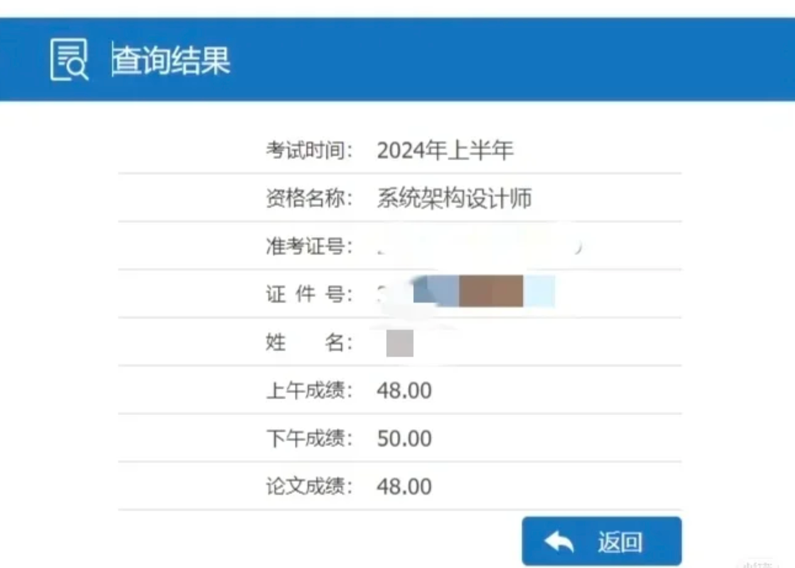
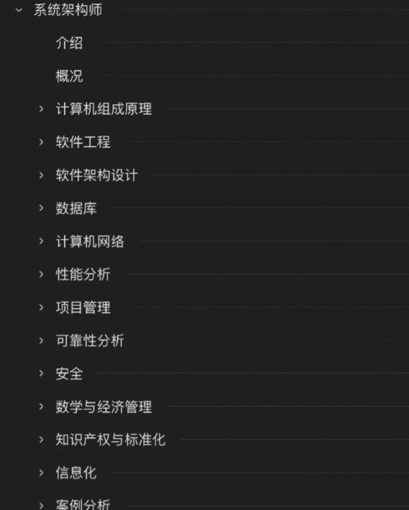
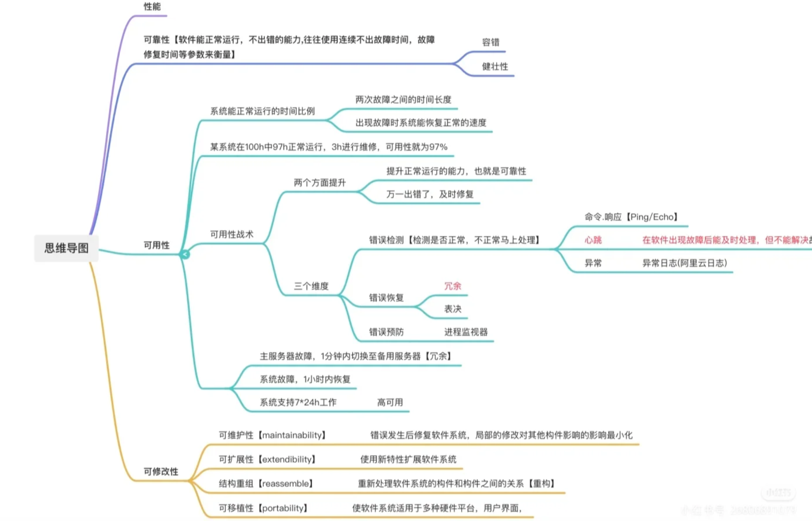

# 系统架构师软考备考经验

这篇文章记录的是我备考软考高级系统架构设计师的真实经历，也顺手把我觉得最有用的方法整理了出来。如果你和我一样，是计算机专业出身、已经参加工作、平时只能利用下班后的时间备考，希望这篇内容能帮你少走一些弯路。

## 一、个人背景

  

我是 23 届计算机专业毕业生，目前做后端开发。工作一年后，我先后通过了中级软件设计师和高级系统架构设计师。

当时决定考高级软考，原因其实很明确：

- 一方面，是希望通过“软考高级 + 成果”的方式，尝试在杭州申报 E 类人才。
- 另一方面，是因为系统架构设计师和我的工作方向比较贴近，学到的很多内容在平时开发和面试里都能用得上，不算为了考证而考证。

## 二、我用到的备考资料

我的资料其实不算多，核心就 4 类：

- 软考系统架构设计师纸质教材
- 近 5 年真题纸质版
- 视频网课
- 《论文一本通》

我的感受是，备考资料不在多，而在能不能反复吃透。尤其是上班以后，时间和精力都有限，如果资料铺得太开，最后很容易变成“看过很多，真正掌握的不多”。

如果只能抓重点，我觉得优先级可以这样排：

1. 教材用来建立知识框架。
2. 真题用来熟悉命题方式和查漏补缺。
3. 视频网课用来提升第一遍理解效率。
4. 论文资料用来集中解决最后阶段的输出问题。

## 三、我的 8 周备考流程

我整个备考周期大概是 8 周，属于节奏比较紧凑的安排。因为我之前考过研，很多 408 相关知识还没有完全忘，所以前期基础部分推进得会快一些。如果你基础相对薄弱，也可以把前两个阶段适当拉长。

### 第一阶段：打基础（第 1-4 周）

这个阶段的目标不是把每一个知识点背得滚瓜烂熟，而是先把整张知识地图搭起来，知道考试大概会考什么、重点在哪里、不同章节之间是怎么关联的。

  

> 📒 我的完整备考笔记：[《系统架构师》语雀笔记](https://www.yuque.com/jiangnan-3o7ge/psketn?#)

我当时主要做了三件事：
- 看视频：每天下班后投入 1 到 2 小时，跟着希赛网视频快速过一遍知识点。
- 做笔记：我没有追求特别精美的手写笔记，而是直接截图课件重点，再叠加自己的理解和补充。
- 画思维导图：每学完一个章节，就把核心知识整理成思维导图，帮助自己建立结构化记忆。

这一阶段我最推荐的组合就是：

`视频学习 + 电子笔记 + 思维导图`

这样做的好处是效率高，而且很适合在职备考。尤其是电子笔记，后面二刷、三刷的时候回看会非常方便。我自己比较推荐用语雀这类在线笔记工具，检索和整理都比较顺手。

### 第二阶段：做真题（第 5-6 周）

我觉得真题是整个备考过程中最重要的部分。我的建议是，刷近几年的真题就够了，不需要额外做太多来源不明的模拟题。把真题吃透，性价比是最高的。

#### 1. 选择题

选择题覆盖面广，知识点很散，建议至少做两遍。

第一遍错得多很正常，重点不在分数，而在订正和复盘。对我来说，真正有提升的，不是“做题那一下”，而是做完以后把错题背后的知识点重新翻回教材、重新理解的过程。

我比较建议这样做：

- 错题不要只看答案对错，要追到知识点本身。
- 尽量把错题里涉及的内容重新定位回教材。
- 把反复出错的知识点沉淀成自己的薄弱清单。

这个过程本质上是在重新学习教材，也是重新搭建知识结构的过程。

#### 2. 案例题

案例题其实有比较明显的高频题型，很多内容每年都在换皮考。比如：

- UML 图
- 架构质量属性
- 数据库设计
- Web 应用相关场景

近几年也会考一些和实际工作更贴近的知识点，比如 Redis、分布式锁这类内容。某种程度上，它和计算机面试里的八股文有点像。如果你本身有开发经验，这部分会比纯学生阶段更容易理解。

所以我的建议是，不要把案例题当成完全陌生的“考试题”，而是把它和实际工作经验、常见面试知识联系起来看，这样理解速度会快很多。

### 第三阶段：论文冲刺（第 7-8 周）

很多人最怕的是论文，但我自己的感受是，论文最怕的不是不会写，而是考前没有提前准备。

我对论文阶段的建议很明确：一定要准备一个“万金油项目”。

这个项目可以是：

- 自己写过的项目
- 网上比较熟悉的开源项目
- 工作中的真实项目

关键不是项目有多大，而是你一定要对它足够熟，尤其要熟悉下面这些内容：

- 系统背景和业务目标
- 整体架构分层
- 核心模块职责
- 关键技术选型
- 性能、扩展性、安全性等设计考虑

我自己用的就是工作中的项目，然后围绕它提前准备了几个常见主题，比如：

- 微服务与分布式
- 面向对象设计
- 架构设计与分层

虽然最后考试时论文题目并不是我预设的那一个，但我还是把自己熟悉的项目和分层架构思路套了进去，最终顺利通过，论文拿到了 48 分。

这也是我最想强调的一点：论文不是临场“现编一个完美项目”，而是提前把一个项目打磨到多个主题都能复用。

## 四、我觉得最有用的几个方法

结合这次备考，我觉得下面几条特别重要：

### 1. 资料少一点，复盘多一点

不要同时开太多资料。真正拉开差距的，往往不是“你看了多少”，而是“你回头消化了多少”。

### 2. 真题比题海更重要

尤其是在职备考，时间是最贵的。与其刷很多杂题，不如把近几年的真题认真做两遍、三遍，把出题思路吃透。

### 3. 错题一定要回到教材

只在题目层面订正，很容易下次继续错。回到教材定位知识点，才是在补底层理解。

### 4. 案例题不要死记硬背

很多案例题其实和实际开发、面试知识是相通的。只要你能把题目和工作里的经验对应起来，很多点会一下子顺很多。

### 5. 论文一定要提前准备“万能项目”

这是我觉得最实用的一条。等到考场上再想项目、想架构、想技术细节，压力会非常大。提前准备好一个可复用项目，考试时心里会稳很多。

### 6. 不要追求完美笔记

笔记的核心价值不是好看，而是后面能不能快速复习、快速定位问题。对上班族来说，高效比精致更重要。

  

## 五、这段备考经历和这个项目的关系

这次备考也直接影响了我后来做这个项目的想法。

因为在准备软考的过程中，我会明显感觉到几个问题：

- 真题、知识点、错题复盘经常是分散的
- 纸质资料和电子资料来回切换，效率并不高
- 很多知识点知道自己不会，但缺少一个长期沉淀和回看的地方
- 论文、案例、选择题之间其实有很多共通点，但缺少一套能串起来的练习方式

所以我开始想，如果能做一个更贴近软考备考场景的平台，把题库练习、错题沉淀、知识点分析，甚至后续的 AI 辅助串起来，可能会比单纯刷题更有价值。

这也是我做「知构软考刷题平台」的起点。

如果你也正在准备系统架构设计师，希望这篇经验能给你一点参考。每个人基础不同、时间安排不同，但只要方法合适、节奏稳定，8 周到 2 个月左右其实是完全有机会冲一把的。

也欢迎你顺手看看这个项目，也许它后面会慢慢长成我备考时想要的那个工具。

---

## 📱 联系我

对软考备考或杭州 E 类人才申报有疑问，欢迎加我微信交流：

  
  
<strong>微信号：</strong>你的微信号

  
<em>备注「软考」或「E 类人才」，我尽快通过</em>

